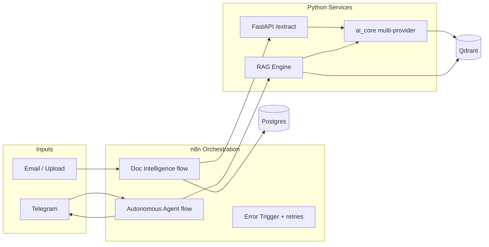

# AI Automation Portfolio

> Real implementations of **Python + n8n** for AI automation and AI engineering roles.
> Clean code, well-thought workflows, honest scope. The repositories speak for themselves.

**[Your Name]** - AI Developer / AI Automation Engineer
[GitHub](https://github.com/yourhandle) - [LinkedIn](https://linkedin.com/in/yourhandle) - your.email@example.com

---

## Why this portfolio

Companies don't just want people who understand models, they want people who can **wire models
into real operations** without reinventing the wheel. This repo shows exactly that: three deep,
runnable projects that demonstrate when to reach for **n8n** (speed of orchestration) and when to
reach for **Python** (complex, robust logic), all backed by a shared, production-style AI core.

No marketing titles. No throwaway tutorials. Five deep projects, polished.

## The projects

| # | Project | What it proves | Stack |
|---|---------|----------------|-------|
| 1 | [Document Intelligence](projects/01-document-intelligence) (Hybrid) | Escaping n8n's limits with real code: a Python microservice does the hard AI work, n8n orchestrates the business flow over webhooks/APIs. | FastAPI, RAG, n8n, Postgres, Docker |
| 2 | [Autonomous Support Agent](projects/02-autonomous-support-agent) (Advanced n8n) | A real autonomous business flow: classify intent with an LLM, query a knowledge base, answer, with **production error handling**. | n8n, Telegram, LLM, Qdrant |
| 3 | [RAG Engine](projects/03-rag-engine) (Pure Python) | Hard AI engineering: retrieval-augmented generation with structured outputs, rate-limit handling, and a real **evaluation harness**. | LangChain, Qdrant, Ragas |
| 4 | [ManoExperta Voice Agent](projects/04-manoexperta-voice-agent) (Voice + n8n) | A production-style voice agent: tool-using LLM, RAG guidance, and full appointment booking with a DB concurrency lock and a fault-tolerance layer. | Vapi, n8n, Pinecone, Postgres, Google Calendar |
| 5 | [Ecommerce Swarm](projects/05-ecommerce-swarm) (Multi-Agent Python) | LangGraph swarm for Shopify support over WhatsApp: specialized agents, ChromaDB RAG, order/refund tools, validation loop, and production webhook security. | LangGraph, Gemini, FastAPI, Shopify, ChromaDB, Redis |

Projects 1-3 share [`shared/ai_core`](shared/ai_core): a multi-provider LLM + embeddings
layer (OpenAI / Anthropic / Gemini, swappable by env var) and a Qdrant vector-store wrapper.
Project 4 is a real client-grade system built directly on Vapi + n8n + Pinecone.

## Architecture at a glance



## Quick start

```bash
# 1. Clone and configure
cp .env.example .env          # fill in your provider API key(s)

# 2. Start the vector database (needed by every project)
docker compose up -d qdrant

# 3. Pick a project and follow its README
#    - projects/03-rag-engine          (start here: pure Python, easiest to run)
#    - projects/01-document-intelligence
#    - projects/02-autonomous-support-agent

# 4. (Optional) full hybrid stack with n8n + postgres
docker compose --profile full up -d
```

## Repository layout

```text
.
├── shared/ai_core/                 # Multi-provider LLM/embeddings + Qdrant wrapper + prompts
├── projects/
│   ├── 01-document-intelligence/   # FastAPI microservice + n8n orchestration (hybrid)
│   ├── 02-autonomous-support-agent/# n8n autonomous Telegram agent
│   ├── 03-rag-engine/              # Pure-Python RAG + evaluation
│   └── 04-manoexperta-voice-agent/ # Vapi voice agent + n8n (RAG + booking + fault tolerance)
├── website/                        # Next.js + Tailwind portfolio site
├── docs/                           # prompt-engineering guide, shared diagrams
├── docker-compose.yml              # Qdrant (+ optional n8n, postgres)
└── .env.example                    # all configuration, documented
```

## Engineering conventions

- **Honesty first** - everything here runs. Where a demo needs an external account
  (Telegram, email), that's clearly marked.
- **Config over hardcoding** - every secret/model lives in `.env` (see `.env.example`).
- **Provider-agnostic** - switch `LLM_PROVIDER=openai|anthropic|gemini` without touching code.
- **Prompts are versioned** - see [`docs/prompt-engineering.md`](docs/prompt-engineering.md).

## Portfolio website

A recruiter-facing showcase lives in [`website/`](website) (Next.js + Tailwind, deploys to
Vercel) summarizing these projects with diagrams and demo recordings.

---

_Replace the placeholders (`[Your Name]`, links, email) with your real details before publishing._
