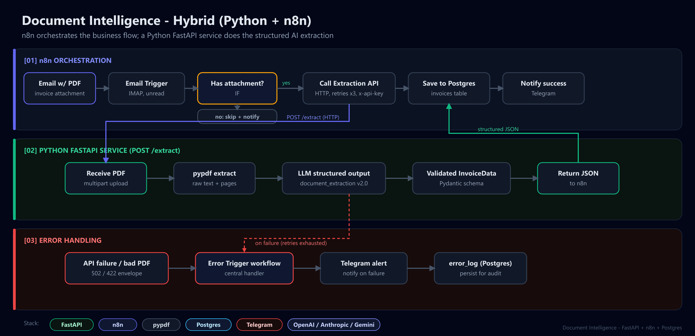
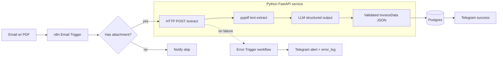

# Project 1 - Document Intelligence (Hybrid: Python + n8n)

> The "holy grail" hybrid. A Python microservice does the hard AI work; n8n orchestrates the
> business flow over webhooks/APIs. This is what separates an engineer from someone wiring
> two pre-built nodes together.

## The problem it solves

A company receives invoices as PDF email attachments and wants them as clean, structured
rows in a database, automatically. PDF parsing + schema-constrained LLM extraction is too
complex to do well inside n8n, so that logic lives in a robust **FastAPI** service. n8n does
what it's great at: triggering on email, moving data, persisting, notifying, and handling
errors.

**What it demonstrates:** knowing when to escape n8n's visual limits with real code, and
connecting the two cleanly over an authenticated HTTP API.

## Architecture



<details>
<summary>Mermaid source</summary>



</details>

- **Python** (`api/`): PDF text extraction (`pypdf`) + LLM extraction into a strict Pydantic
  schema via the shared [`ai_core`](../../shared/ai_core). Returns validated JSON.
- **n8n** (`n8n/`): the orchestration and the **error handling**.

## The Python service (`api/`)

| Endpoint | Description |
|----------|-------------|
| `GET /health` | Liveness + which provider/model is active |
| `POST /extract` | Multipart PDF upload -> `ExtractionResponse` (structured invoice JSON) |

- Auth via a shared secret in the `x-api-key` header (`DOC_API_KEY`).
- 10 MB upload cap, content-type validation, and clean error envelopes (`{"success": false, "error": ...}`) so n8n can branch reliably.
- A sample successful response is in [`docs/sample-output.json`](docs/sample-output.json).

### Run the API

```bash
# from repo root: Qdrant not required here, but the LLM key is
cp .env.example .env                      # set OPENAI_API_KEY + DOC_API_KEY
docker compose up -d qdrant               # (optional, only if you extend with RAG)

cd projects/01-document-intelligence/api
pip install -e ../../../shared
pip install -r requirements.txt
uvicorn app.main:app --reload             # http://localhost:8000/docs
```

Test it:

```bash
curl -s -X POST http://localhost:8000/extract \
  -H "x-api-key: $DOC_API_KEY" \
  -F "file=@/path/to/invoice.pdf" | jq
```

### Run with Docker

```bash
# build context must be the repo root (to include shared/)
docker build -f projects/01-document-intelligence/api/Dockerfile -t doc-intel .
docker run --rm -p 8000:8000 --env-file .env doc-intel
```

## The n8n flows (`n8n/`)

Import both JSON files into n8n (**Workflows -> Import from File**):

1. [`workflow.json`](n8n/workflow.json) - **Invoice Orchestration**: Email Trigger ->
   check attachment -> `POST /extract` (3 retries, 60s timeout) -> insert into Postgres ->
   Telegram success.
2. [`error-handler.json`](n8n/error-handler.json) - **Error Handler**: an `Error Trigger`
   workflow that fires whenever the main flow fails, shaping the error and sending a
   Telegram alert + logging it to the `error_log` table.

The main workflow references the error handler via `settings.errorWorkflow`, and the HTTP
node has built-in retries. This is the difference between "real engineer" and "hobbyist":
failures are caught, alerted, retried and logged.

> See [`docs/demo`](docs/demo) for the demo recording (script + placeholder).

### Configuration used by the flows

| Env / credential | Purpose |
|------------------|---------|
| `RAG_API_URL` | Base URL n8n uses to reach the FastAPI service |
| `DOC_API_KEY` | Sent as `x-api-key` to authenticate to the service |
| `TELEGRAM_ALERT_CHAT_ID` | Chat that receives success / failure notifications |
| Postgres credential | Target for the `invoices` and `error_log` tables (`db/schema.sql`) |

## Database

Apply [`db/schema.sql`](db/schema.sql) to create the `invoices` and `error_log` tables.

## Tests

```bash
cd api
pytest          # offline: PDF extraction + LLM call are faked
```

## Layout

```text
01-document-intelligence/
├── api/                  # FastAPI microservice (+ Dockerfile, tests)
│   └── app/{main,extraction,schemas}.py
├── n8n/                  # workflow.json + error-handler.json
├── db/schema.sql         # Postgres tables
└── docs/                 # sample output + demo assets
```
