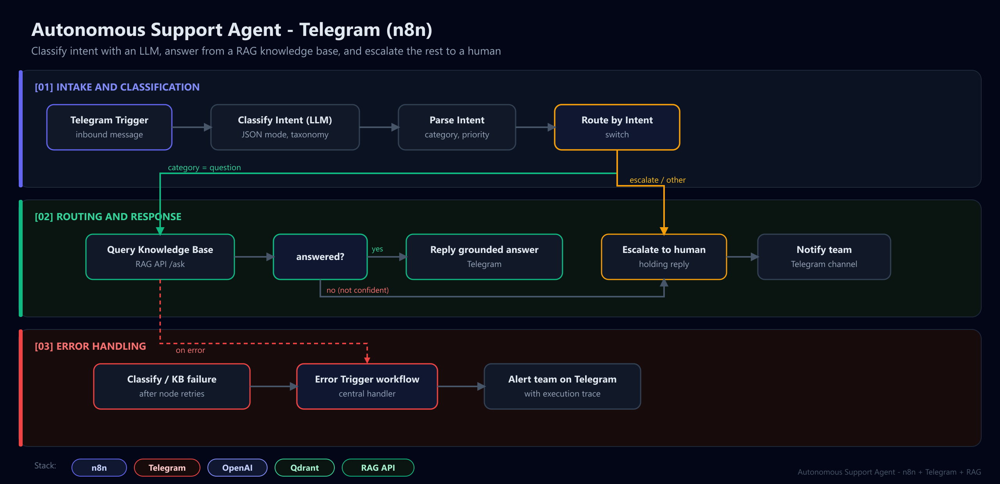
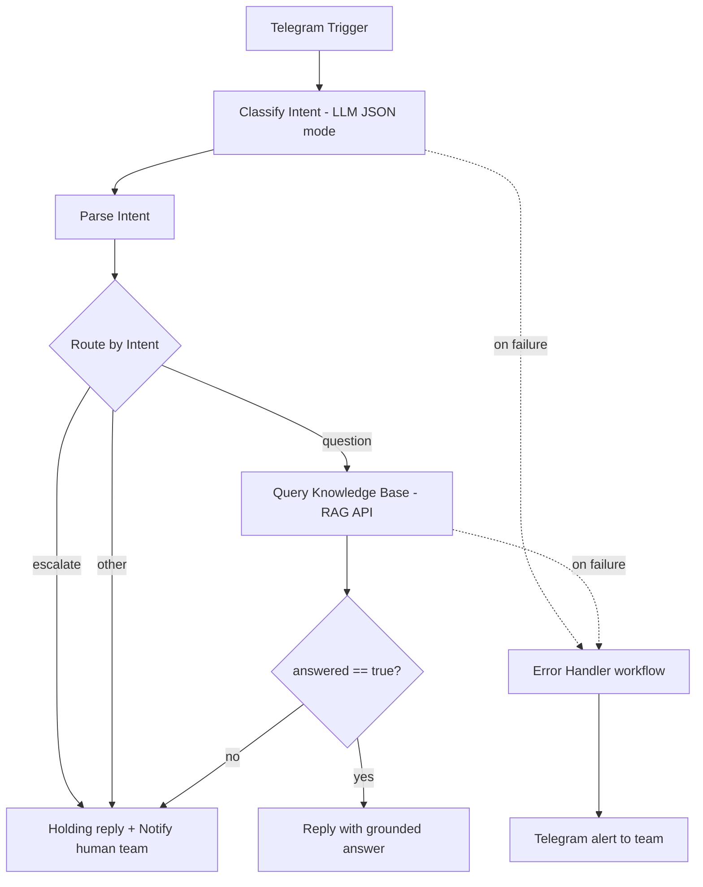

# Project 2 - Autonomous Support Agent (Advanced n8n)

> A real autonomous business flow on Telegram: classify intent with an LLM, answer questions
> from a knowledge base, and escalate sensitive cases to a human, with production-grade
> error handling. Not a "new tweet" alert.

## The problem it solves

Support inboxes are flooded with repetitive questions mixed with things that genuinely need
a human (billing, complaints). This agent triages every message automatically: it answers
the easy, knowable questions instantly from a RAG knowledge base and routes the rest to the
team, with the right priority, before a human ever looks at it.

## Architecture



<details>
<summary>Mermaid source</summary>



</details>

## Why this is "engineer", not "hobbyist"

- **Conservative escalation** - the classifier escalates whenever confidence is low; the
  agent never confidently guesses on billing or complaints. See
  [`docs/intent-taxonomy.md`](docs/intent-taxonomy.md).
- **Grounded answers only** - questions are answered via the RAG engine, which returns
  `answered: false` when the KB lacks the info; the agent then escalates instead of
  hallucinating.
- **Real error handling** - every external node has retries, and a dedicated
  `Error Trigger` workflow ([`n8n/error-handler.json`](n8n/error-handler.json)) alerts the
  team if anything still fails. This is the part recruiters look for.

## How the pieces connect

```text
Telegram  ->  n8n agent  ->  RAG Engine API (Project 3)  ->  Qdrant
              (this)         /ask endpoint                   knowledge base
```

The knowledge base is the [`knowledge/`](knowledge) folder, ingested with Project 3's CLI.

## Run it locally

```bash
# 1. Start Qdrant + n8n
docker compose --profile full up -d        # from repo root

# 2. Ingest this project's knowledge base into the RAG engine
cd projects/03-rag-engine
pip install -e ../../shared && pip install -r requirements.txt
python -m rag_engine.cli ingest ../02-autonomous-support-agent/knowledge --recreate

# 3. Serve the RAG engine so n8n can query it
pip install "fastapi>=0.111" "uvicorn[standard]>=0.30"
uvicorn rag_engine.serve:app --port 8001   # set RAG_API_URL accordingly in n8n

# 4. In n8n (http://localhost:5678), import both workflows and add credentials:
#    - Telegram (bot token)  - OpenAI (API key)
#    Import: n8n/workflow.json  and  n8n/error-handler.json
```

> When n8n runs in Docker and the RAG API runs on the host, use
> `RAG_API_URL=http://host.docker.internal:8001`.

### Configuration

| Env / credential | Purpose |
|------------------|---------|
| Telegram credential | Bot token for the trigger and replies |
| OpenAI credential | Used by the intent classifier node |
| `RAG_API_URL` | Base URL of the RAG engine `/ask` endpoint |
| `SUPPORT_TEAM_CHAT_ID` | Telegram chat that receives escalations + failure alerts |

## What's in here

```text
02-autonomous-support-agent/
├── n8n/
│   ├── workflow.json        # the agent (classify -> route -> answer / escalate)
│   └── error-handler.json   # Error Trigger -> Telegram alert
├── knowledge/               # support KB (ingested by the RAG engine)
└── docs/
    ├── intent-taxonomy.md   # categories + routing rules
    ├── sample-conversations.md
    └── demo/                # demo recording (script + placeholder)
```

See [`docs/demo`](docs/demo) for the demo recording.
