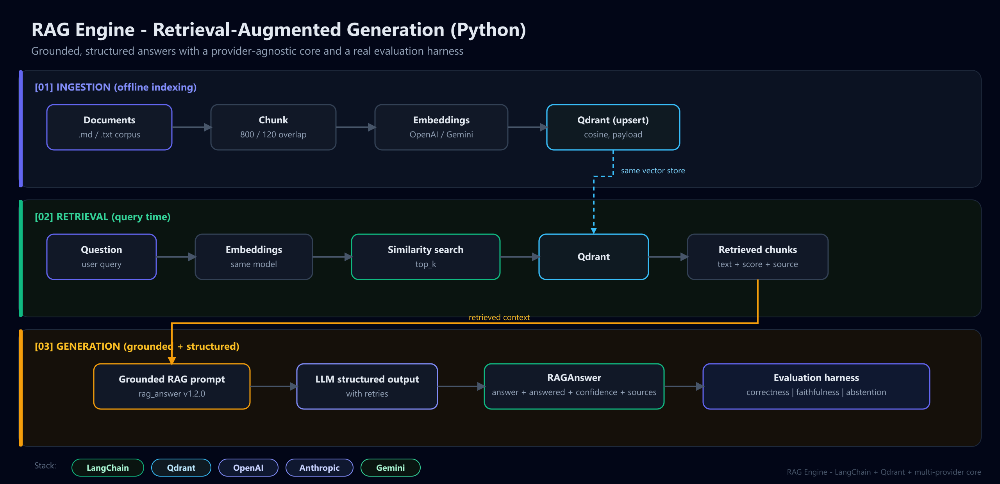
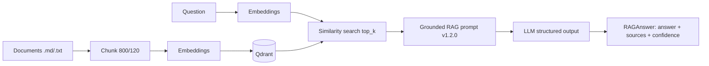

# Project 3 - RAG Engine (Pure Python + Evaluation)

> Hard AI engineering: a Retrieval-Augmented Generation pipeline with grounded, structured
> output, provider-agnostic models, rate-limit handling, and a real **evaluation harness**.

This is the "pure Python AI" project that backs up the AI Engineer title. No no-code tools,
just clean retrieval + generation code that you can run, test, and measure.

## The problem it solves

LLMs hallucinate and can't answer questions about your private documents. This engine
ingests a document set, retrieves the most relevant passages for a question, and forces the
model to answer **only** from that retrieved context (or to say it doesn't know). Crucially,
it ships with an evaluation harness so quality is measured, not assumed.

## Architecture



<details>
<summary>Mermaid source</summary>



</details>

It is built on the shared [`ai_core`](../../shared/ai_core) layer, so switching between
OpenAI / Anthropic / Gemini is a one-line `.env` change. Retrieval uses Qdrant with Cosine
distance; generation uses LangChain's structured output to return a validated Pydantic model.

## Key engineering decisions

- **Grounded by construction** - the [`rag_answer`](../../shared/ai_core/prompts/rag_answer.yaml)
  prompt forbids answering outside the context and mandates an explicit "I don't know".
- **Structured output** - the model returns a `GroundedAnswer` (answer, answered, confidence),
  not free text, so downstream systems can branch on `answered`/`confidence`.
- **Rate-limit resilience** - transient 429/timeout/overloaded errors are retried with
  exponential backoff (see `structured_chat` in `ai_core`).
- **Measured, not vibes** - `eval/` scores correctness, faithfulness and abstention.

## Run it locally

```bash
# 0. From the repo root, start Qdrant and configure your key
docker compose up -d qdrant
cp .env.example .env          # set OPENAI_API_KEY (or switch LLM_PROVIDER)

# 1. Install (shared core + this project)
cd projects/03-rag-engine
pip install -e ../../shared
pip install -r requirements.txt

# 2. Ingest the sample knowledge base
python -m rag_engine.cli ingest data/knowledge --recreate

# 3. Ask a question
python -m rag_engine.cli ask "What distance metric do the Qdrant collections use?"
python -m rag_engine.cli ask "What is the capital of France?" --json   # should abstain
```

### Expected results

```text
Q: What distance metric do the Qdrant collections use?
A: Cosine distance.
   (answered=True, confidence=0.95)

Sources:
  - qdrant.md (score=0.89): ## Distance metrics  Qdrant supports Cosine, Dot product...
```

The capital-of-France question is intentionally outside the knowledge base; the engine
answers `"I don't have enough information to answer that."` with `answered=false`.

## Evaluation

```bash
python eval/evaluate.py
```

This runs every question in [`eval/dataset.jsonl`](eval/dataset.jsonl) through the pipeline
and scores:

| Metric | What it measures |
|--------|------------------|
| **correctness** | Does the answer match the ground truth? (LLM-as-judge, 0..1) |
| **faithfulness** | Is the answer fully supported by retrieved context? (LLM-as-judge, 0..1) |
| **abstention** | For out-of-scope questions, did it correctly refuse? (0/1) |

Example summary output (illustrative; your numbers depend on the model/provider):

```text
=== Summary ===
  questions   : 8
  correctness : 0.94
  faithfulness: 1.0
  abstention  : 1.0
```

> Want industry-standard metrics? The same `dataset.jsonl` feeds straight into
> [Ragas](https://docs.ragas.io) (faithfulness / answer_relevancy / context_precision).
> The custom judge here keeps the project runnable with zero extra dependencies.

## Optional: serve it over HTTP

The pipeline is pure Python, but a thin FastAPI layer lets other systems query it. This is
exactly how [Project 2](../02-autonomous-support-agent) (the n8n agent) reaches the
knowledge base.

```bash
pip install "fastapi>=0.111" "uvicorn[standard]>=0.30"
uvicorn rag_engine.serve:app --port 8001
# POST http://localhost:8001/ask  {"question": "..."}
```

## Tests

```bash
pytest
```

Tests run fully offline (no API/Qdrant needed) using an in-memory fake store and a
monkey-patched LLM call, covering chunking, retrieval grounding, abstention, and prompt
rendering.

## Layout

```text
03-rag-engine/
├── src/rag_engine/
│   ├── ingest.py        # read -> chunk -> embed -> upsert
│   ├── pipeline.py      # retrieve -> grounded structured answer
│   ├── schemas.py       # RAGAnswer / GroundedAnswer / SourceCitation
│   └── cli.py           # `ingest` and `ask` commands
├── data/knowledge/      # sample corpus
├── eval/                # golden dataset + evaluation harness
└── tests/               # offline unit tests
```
