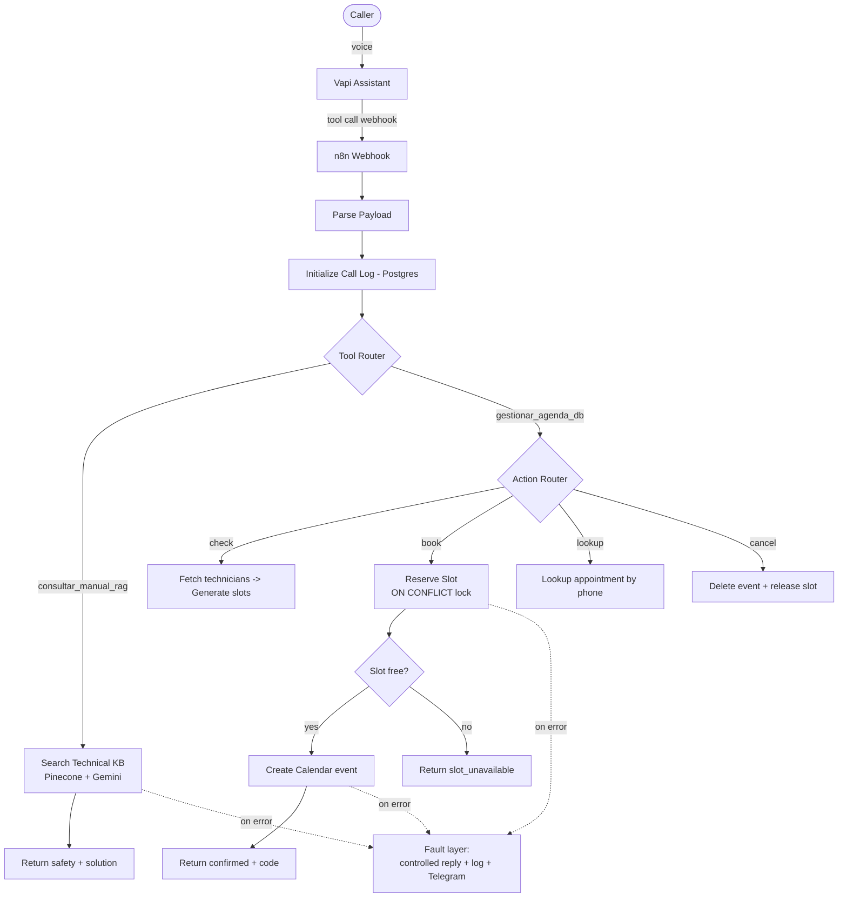
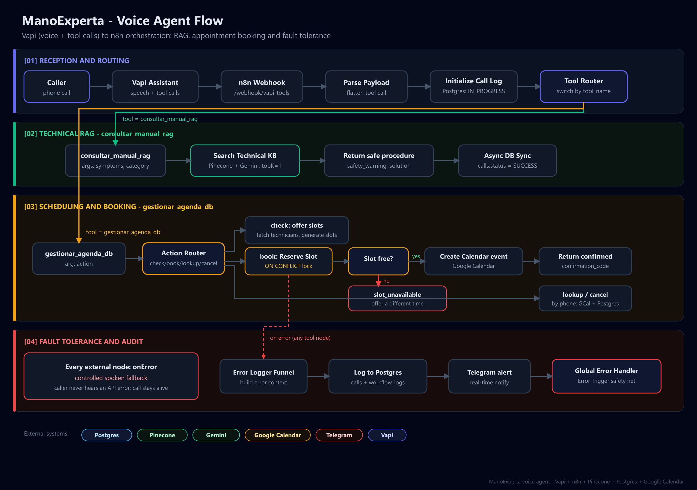

# Project 4 - ManoExperta Voice Agent (Vapi + n8n)

> A production-style **voice AI agent** for a residential maintenance company. It answers
> calls, gives safe technical guidance from a knowledge base, and books / reschedules /
> cancels appointments end to end, with a real concurrency lock and a full fault-tolerance
> layer that keeps the call alive when something breaks.

This is the most operationally complete project in the portfolio: it touches voice (Vapi),
orchestration (n8n), vector search (Pinecone + Gemini), a transactional database (Postgres),
and a calendar (Google Calendar), all wired for low latency and resilience.

## The problem it solves

A maintenance business gets phone calls all day: "my faucet is leaking", "I need a
technician tomorrow", "I want to cancel my visit". Staffing that 24/7 is expensive and
inconsistent. ManoExperta handles the call autonomously: it triages the issue, gives a safe
first tip from the official manual, and manages the appointment, while never confirming a
booking that the system didn't actually commit.

## What it demonstrates

- Designing a **stateful, tool-using voice agent** (not a chatbot): strict conversation
  protocol, temporal reasoning for relative dates, and proactive call termination.
- **Hybrid execution**: the LLM/voice layer handles conversation; n8n + Postgres handle the
  hard, correctness-critical logic (locking, transactions, calendar sync).
- **Engineering for failure**: every external call has a controlled fallback so the caller
  never hears "API error", plus structured error logging and Telegram alerts.

## Architecture



See [`docs/tools.md`](docs/tools.md) for the exact tool request/response contracts and the
concurrency design.

## Components

| Layer | Tech | Role |
|-------|------|------|
| Voice + LLM | **Vapi** | Speech, turn-taking, tool calling; driven by the system prompt |
| Orchestration | **n8n** | Routes tool calls, runs the business logic, returns Vapi-shaped JSON |
| Knowledge base | **Pinecone + Gemini embeddings** | Retrieves the official safe procedure per symptom |
| Database | **Postgres** | Calls + customers, technician catalogue, slot lock, transcript &amp; audit logs |
| Calendar | **Google Calendar** | Real availability + event creation/deletion |
| Alerting | **Telegram** | Inline + global error notifications |

## Files

```text
04-manoexperta-voice-agent/
├── vapi/
│   └── system-prompt.txt        # the assistant's full system prompt (Spanish)
├── n8n/
│   ├── vapi-core-api.json        # the main workflow (tool calls -> business logic)
│   └── global-error-handler.json # global Error Trigger -> Telegram safety net
├── db/
│   └── schema.sql                # calls, customers, technicians, appointment_slots, chat_history, workflow_logs
└── docs/
    ├── tools.md                  # tool contracts + concurrency design
    └── demo/                     # demo recording (script + placeholder)
```

## How the resilience works

The workflow has a dedicated **fault-tolerance layer** (sticky note `[04]` in the canvas):

- Every risky node uses `onError: continueErrorOutput` and routes to a `Set Ctx - *` node
  that builds a structured error context (`error_status`, `error_node`, `call_id`, ...).
- All errors funnel into `Error Logger Funnel` -> `Log Error (calls)` ->
  `Log Error (workflow_logs)` -> `Telegram Error Alert`.
- The caller always gets a natural spoken fallback (e.g. "the schedule is taking a moment;
  an advisor will confirm by WhatsApp") instead of a dead call.
- A separate [`global-error-handler.json`](n8n/global-error-handler.json) catches anything
  the inline handling misses (set it as the workflow's *Error Workflow*).

## Run it / import it

> This project integrates external SaaS (Vapi, Pinecone, Google, Telegram), so it isn't a
> one-command local run. The steps to reproduce:

1. **Database**: apply [`db/schema.sql`](db/schema.sql) to a Postgres instance and seed a
   couple of `technicians`.
2. **n8n**: import both workflows from [`n8n/`](n8n). Create credentials for Postgres,
   Pinecone, Google (Gemini + Calendar) and Telegram, and select them on the nodes.
   Replace `YOUR_TELEGRAM_CHAT_ID`. In Settings, set the *Error Workflow* to
   "ManoExperta: Global Error Handler".
3. **Pinecone**: create the index/namespace referenced by `Search Technical KB`
   (`manoexperta-technical-rag-v1`) and ingest your technical manuals (each chunk's metadata
   must include `seguridad` and `solucion`).
4. **Vapi**: create an assistant, paste [`vapi/system-prompt.txt`](vapi/system-prompt.txt),
   and register the two tools (`consultar_manual_rag`, `gestionar_agenda_db`) pointing to the
   n8n webhook URL (`/webhook/vapi-tools`).

## The prompt

The full assistant prompt lives in [`vapi/system-prompt.txt`](vapi/system-prompt.txt). It is
written in Spanish (neutral Bogota/Medellin tone) and encodes the conversation protocol,
date reasoning, tool-result interpretation, the book-before-cancel reschedule rule, the
failure protocol, and a strict call-termination policy. Prompt-engineering rationale for the
portfolio is summarized in [`../../docs/prompt-engineering.md`](../../docs/prompt-engineering.md).

## Architecture diagram



## Publishing notes

These exports are safe to publish: credential ids have been replaced with placeholders
(`YOUR_POSTGRES_CRED_ID`, `YOUR_PINECONE_CRED_ID`, `YOUR_GEMINI_CRED_ID`, `YOUR_GCAL_CRED_ID`),
the live webhook id is `YOUR_VAPI_WEBHOOK_ID`, and the instance/version ids were removed. No
API keys were ever stored in n8n exports. On import, just map each node to your own
credentials.
